# 宅域知识库 — 目录结构图

> 自动生成于 `data/structure.yaml`
> 改结构后跑 `python tools/render_structure.py --write` 重新生成
> 当前共 41 个节点

---

## 📊 Mermaid 可视化

```mermaid
graph TD
    classDef rootStyle fill:#7B2CBF,stroke:#5A189A,color:#fff,stroke-width:3px;
    classDef dataStyle fill:#3A86FF,stroke:#2667CC,color:#fff;
    classDef meetStyle fill:#FB5607,stroke:#C2410C,color:#fff;
    classDef bpStyle fill:#06A77D,stroke:#048A66,color:#fff;
    classDef rawStyle fill:#9D4EDD,stroke:#7B2CBF,color:#fff;
    classDef toolStyle fill:#FFB703,stroke:#FB8500,color:#000;
    classDef docStyle fill:#EF476F,stroke:#C0306B,color:#fff;
    classDef archStyle fill:#6B7280,stroke:#4B5563,color:#fff;

    ROOT["<b>zhaiyu-bp/</b><br/>宅域宠物洗护店项目"]
    n93004["<b>data/</b><br/>唯一事实源"]
    n27732["<b>data/facts.yaml</b><br/>启动资金/成本/股份/服务定价等所有数字"]
    n22250["<b>data/decisions.yaml</b><br/>28 条决策记录（含历史、已替换、生效）"]
    n47547["<b>data/structure.yaml</b><br/>目录结构定义（就是本文件）"]
    n65693["<b>meetings/</b><br/>会议笔记"]
    n73623["<b>meetings/_template.md</b><br/>四段式会议笔记模板（强制冲突追踪）"]
    n3257["<b>meetings/2026-06-26-创始人A快速会议.md</b><br/>第一次正式会议（启动资金/股份/分润机制敲定）"]
    n41373["<b>bps/</b><br/>业务交付物"]
    n38462["<b>bps/store-front/</b><br/>门店商业计划书（bp.html/bp.md/布局编辑器/选址地图）"]
    n14731["<b>bps/store-front/bp.html</b><br/>商业计划书网页版（18页幻灯片）"]
    n89101["<b>bps/store-front/bp.md</b><br/>商业计划书 Markdown 源文档（含财务明细）"]
    n94807["<b>bps/store-front/site-map.html</b><br/>选址分析地图（高德API + 11个真实POI）"]
    n81205["<b>bps/store-front/layout-editor.html</b><br/>49㎡ 门店布局编辑器（Konva.js + 碰撞检测）"]
    n76642["<b>bps/landing-for-coop/</b><br/>合作着陆页（小红书引流/招合伙人）"]
    n95943["<b>bps/landing-for-coop/landing.html</b><br/>合作着陆页主入口"]
    n51154["<b>bps/landing-for-coop/index.html</b><br/>合作着陆页重定向页"]
    n62998["<b>raw/</b><br/>原始素材"]
    n76058["<b>raw/meetings/</b><br/>各次会议的原始素材"]
    n23903["<b>raw/meetings/2026-06-26/</b><br/>2026-06-26 会议的原始素材"]
    n3541["<b>raw/meetings/2026-06-26/元宝纪要.txt</b><br/>元宝AI纪要全量文字（73KB）"]
    n2340["<b>raw/meetings/2026-06-26/成本收益分析.xlsx</b><br/>会议填写的财务模型"]
    n19939["<b>raw/meetings/2026-06-26/README.md</b><br/>该素材包的说明 + 录屏位置指引"]
    n22051["<b>tools/</b><br/>一致性工具"]
    n32238["<b>tools/verify.py</b><br/>一致性校验（扫旧数字残留/不存在的DEC引用/未同步决议）"]
    n25285["<b>tools/render_index.py</b><br/>自动生成 INDEX.md"]
    n72422["<b>tools/render_structure.py</b><br/>自动生成 docs/structure.md（Mermaid图+表格）"]
    n39156["<b>tools/render_directory.py</b><br/>自动生成 DIRECTORY.md（实景目录树+说明）"]
    n57820["<b>assets/</b><br/>共享资源（Logo、品牌素材）"]
    n84859["<b>assets/zhaiyu-logo.png</b><br/>宅域品牌 Logo"]
    n66894["<b>archive/</b><br/>旧版本/工作过程文件归档"]
    n52317["<b>archive/2026-06-16/</b><br/>立项当天的工作文件（inputs/outputs/review/wor"]
    n22542["<b>README.md</b><br/>项目入口（这是什么/怎么用/为什么这样设计）"]
    n29335["<b>INDEX.md</b><br/>自动生成的知识地图（不要手改）"]
    n79464["<b>DECISIONS.md</b><br/>决策记录人类可读版（数据源在 data/decisions.yaml）"]
    n68776["<b>DIRECTORY.md</b><br/>目录结构总览（自动生成，给合伙人看的）"]
    n53806["<b>docs/</b><br/>项目说明与自动生成文档"]
    n64682["<b>docs/optimization-plan.md</b><br/>2026-07-01 全方位优化方案（客户档案/投资人话术/业务分层/"]
    n28418["<b>docs/investor-objection-playbook.md</b><br/>投资人异议话术库（实体店/平台/获客/信任/盈利标准回答）"]
    n17191["<b>docs/structure.md</b><br/>目录结构 Mermaid 可视化图（自动生成）"]
    n91436["<b>.gitignore</b><br/>忽略规则（大文件/中间产物不入库）"]

    ROOT --> n93004
    ROOT --> n27732
    ROOT --> n22250
    ROOT --> n47547
    ROOT --> n65693
    ROOT --> n73623
    ROOT --> n3257
    ROOT --> n41373
    ROOT --> n38462
    ROOT --> n14731
    ROOT --> n89101
    ROOT --> n94807
    ROOT --> n81205
    ROOT --> n76642
    ROOT --> n95943
    ROOT --> n51154
    ROOT --> n62998
    ROOT --> n76058
    ROOT --> n23903
    ROOT --> n3541
    ROOT --> n2340
    ROOT --> n19939
    ROOT --> n22051
    ROOT --> n32238
    ROOT --> n25285
    ROOT --> n72422
    ROOT --> n39156
    ROOT --> n57820
    ROOT --> n84859
    ROOT --> n66894
    ROOT --> n52317
    ROOT --> n22542
    ROOT --> n29335
    ROOT --> n79464
    ROOT --> n68776
    ROOT --> n53806
    ROOT --> n64682
    ROOT --> n28418
    ROOT --> n17191
    ROOT --> n91436
    class ROOT rootStyle;
    class n27732 dataStyle;
    class n22250 dataStyle;
    class n47547 dataStyle;
    class n73623 docStyle;
    class n3257 docStyle;
    class n89101 docStyle;
    class n19939 docStyle;
    class n22542 docStyle;
    class n29335 docStyle;
    class n79464 docStyle;
    class n68776 docStyle;
    class n64682 docStyle;
    class n28418 docStyle;
    class n17191 docStyle;
```



---

## 📋 完整目录表

| 路径 | 类型 | 用途 | 受众 | 何时读 | 何时写 |
|---|---|---|---|---|---|
| `zhaiyu-bp/data/` | 📁 目录 | 唯一事实源 — 所有数字/决策的结构化存储 | ai | 需要确认某个数字、查找某条决策 | 任何数字/决议变化（必须第一个改这里） |
| `zhaiyu-bp/data/facts.yaml` | 📄 文件 | 启动资金/成本/股份/服务定价等所有数字 | ai | AI 回答任何财务/数字问题前 | 财务模型调整 |
| `zhaiyu-bp/data/decisions.yaml` | 📄 文件 | 28 条决策记录（含历史、已替换、生效） | ai | 解释为什么这样设计 / 追溯决策时间线 | 任何新决议、修订、废弃 |
| `zhaiyu-bp/data/structure.yaml` | 📄 文件 | 目录结构定义（就是本文件） | ai | 改目录结构前 | 任何目录调整 |
| `zhaiyu-bp/meetings/` | 📁 目录 | 会议笔记 — 每次会议的决议+冲突+待办结构化记录 | ai,human,partner | 了解一次会议的决定 / 找历史讨论 | 每次会议后立刻写一篇 |
| `zhaiyu-bp/meetings/_template.md` | 📄 文件 | 四段式会议笔记模板（强制冲突追踪） | human | — | — |
| `zhaiyu-bp/meetings/2026-06-26-创始人A快速会议.md` | 📄 文件 | 第一次正式会议（启动资金/股份/分润机制敲定） | ai,human,partner | — | — |
| `zhaiyu-bp/bps/` | 📁 目录 | 业务交付物 — 给外人看的成品 | partner,investor,customer | 给投资人/合伙人/客户演示 | 演示材料更新 |
| `zhaiyu-bp/bps/store-front/` | 📁 目录 | 门店商业计划书（bp.html/bp.md/布局编辑器/选址地图） |  | — | — |
| `zhaiyu-bp/bps/store-front/bp.html` | 📄 文件 | 商业计划书网页版（18页幻灯片） | partner,investor | — | — |
| `zhaiyu-bp/bps/store-front/bp.md` | 📄 文件 | 商业计划书 Markdown 源文档（含财务明细） | partner | — | — |
| `zhaiyu-bp/bps/store-front/site-map.html` | 📄 文件 | 选址分析地图（高德API + 11个真实POI） | investor | — | — |
| `zhaiyu-bp/bps/store-front/layout-editor.html` | 📄 文件 | 49㎡ 门店布局编辑器（Konva.js + 碰撞检测） | investor | — | — |
| `zhaiyu-bp/bps/landing-for-coop/` | 📁 目录 | 合作着陆页（小红书引流/招合伙人） |  | — | — |
| `zhaiyu-bp/bps/landing-for-coop/landing.html` | 📄 文件 | 合作着陆页主入口 | partner,customer | — | — |
| `zhaiyu-bp/bps/landing-for-coop/index.html` | 📄 文件 | 合作着陆页重定向页 |  | — | — |
| `zhaiyu-bp/raw/` | 📁 目录 | 原始素材 — 元宝纪要/Excel/录屏，按原样归档 | human | 查证某个数字/引述/录屏内容 | 每次新会议/新素材 |
| `zhaiyu-bp/raw/meetings/` | 📁 目录 | 各次会议的原始素材 |  | — | — |
| `zhaiyu-bp/raw/meetings/2026-06-26/` | 📁 目录 | 2026-06-26 会议的原始素材 |  | — | — |
| `zhaiyu-bp/raw/meetings/2026-06-26/元宝纪要.txt` | 📄 文件 | 元宝AI纪要全量文字（73KB） |  | — | — |
| `zhaiyu-bp/raw/meetings/2026-06-26/成本收益分析.xlsx` | 📄 文件 | 会议填写的财务模型 |  | — | — |
| `zhaiyu-bp/raw/meetings/2026-06-26/README.md` | 📄 文件 | 该素材包的说明 + 录屏位置指引 |  | — | — |
| `zhaiyu-bp/tools/` | 📁 目录 | 一致性工具 — 保证知识库不自相矛盾 | ai | 改完任何文件后 | 新规则/新校验 |
| `zhaiyu-bp/tools/verify.py` | 📄 文件 | 一致性校验（扫旧数字残留/不存在的DEC引用/未同步决议） |  | — | — |
| `zhaiyu-bp/tools/render_index.py` | 📄 文件 | 自动生成 INDEX.md |  | — | — |
| `zhaiyu-bp/tools/render_structure.py` | 📄 文件 | 自动生成 docs/structure.md（Mermaid图+表格） |  | — | — |
| `zhaiyu-bp/tools/render_directory.py` | 📄 文件 | 自动生成 DIRECTORY.md（实景目录树+说明） |  | — | — |
| `zhaiyu-bp/assets/` | 📁 目录 | 共享资源（Logo、品牌素材） | human | — | — |
| `zhaiyu-bp/assets/zhaiyu-logo.png` | 📄 文件 | 宅域品牌 Logo |  | — | — |
| `zhaiyu-bp/archive/` | 📁 目录 | 旧版本/工作过程文件归档 | human | 想看当时怎么做的 | 任何旧文件需要归档时 |
| `zhaiyu-bp/archive/2026-06-16/` | 📁 目录 | 立项当天的工作文件（inputs/outputs/review/work） |  | — | — |
| `zhaiyu-bp/README.md` | 📄 文件 | 项目入口（这是什么/怎么用/为什么这样设计） | human,partner | 第一次打开项目 | 入口/导航逻辑变化 |
| `zhaiyu-bp/INDEX.md` | 📄 文件 | 自动生成的知识地图（不要手改） | ai,human | — | — |
| `zhaiyu-bp/DECISIONS.md` | 📄 文件 | 决策记录人类可读版（数据源在 data/decisions.yaml） | ai,human,partner | 了解项目所有关键决策 | — |
| `zhaiyu-bp/DIRECTORY.md` | 📄 文件 | 目录结构总览（自动生成，给合伙人看的） | human,partner | — | — |
| `zhaiyu-bp/docs/` | 📁 目录 | 项目说明与自动生成文档 |  | — | — |
| `zhaiyu-bp/docs/optimization-plan.md` | 📄 文件 | 2026-07-01 全方位优化方案（客户档案/投资人话术/业务分层/电竞样板间/财务/股权/执行清单） | human,partner | — | — |
| `zhaiyu-bp/docs/investor-objection-playbook.md` | 📄 文件 | 投资人异议话术库（实体店/平台/获客/信任/盈利标准回答） | human,partner | — | — |
| `zhaiyu-bp/docs/structure.md` | 📄 文件 | 目录结构 Mermaid 可视化图（自动生成） | human,partner | — | — |
| `zhaiyu-bp/.gitignore` | 📄 文件 | 忽略规则（大文件/中间产物不入库） |  | — | — |

---


## 🎨 颜色说明

| 颜色 | 含义 | 例子 |
|---|---|---|
| 🟣 紫色 (root) | 项目根 | zhaiyu-bp/ |
| 🔵 蓝色 (data) | 数据源（机器读的真相） | data/facts.yaml |
| 🟠 橙色 (meetings) | 会议笔记 | meetings/2026-06-26-...md |
| 🟢 绿色 (bps) | 业务交付物（给外人看的） | bps/store-front/bp.html |
| 🟪 浅紫 (raw) | 原始素材（人类查证用） | raw/meetings/2026-06-26/ |
| 🟡 黄色 (tools) | 工具脚本 | tools/verify.py |
| 🔴 红色 (docs) | 文档入口 | README.md / DECISIONS.md |
| ⚫ 灰色 (archive) | 归档 | archive/2026-06-16/ |


## 🔄 标准工作流

### 场景 1：改一个数字（比如启动资金 12万 → 15万）

```bash
# 1. 先改唯一数据源
# 编辑 data/facts.yaml 的 startup.total

# 2. 同步到所有引用此数字的文档
# 编辑 bps/store-front/bp.html / bp.md
# 编辑 bps/store-front/README.md
# 编辑 DECISIONS.md

# 3. 跑校验
python tools/verify.py
# 必须输出: ✅ 通过！

# 4. 提交
git add . && git commit -m "调整启动资金 12→15万"
```

### 场景 2：开了一次新会议

```bash
# 1. 把素材丢到 raw/
cp 元宝纪要.txt raw/meetings/2026-07-15/
cp 会议.xlsx raw/meetings/2026-07-15/

# 2. 复制模板写笔记
cp meetings/_template.md meetings/2026-07-15-xxx.md
# 必须填第3段（冲突追踪）！没有就写"无冲突"

# 3. 加 DEC 条目
# 编辑 data/decisions.yaml
# 编辑 meetings/2026-07-15-xxx.md 的第2段

# 4. 跑校验
python tools/verify.py
python tools/render_index.py --write
```

### 场景 3：调整目录结构

```bash
# 1. 编辑 data/structure.yaml（这是结构的事实源）
# 2. 跑这个脚本重出图
python tools/render_structure.py --write
python tools/render_directory.py --write
# 3. 实际移动文件
# 4. 跑校验
python tools/verify.py
```
